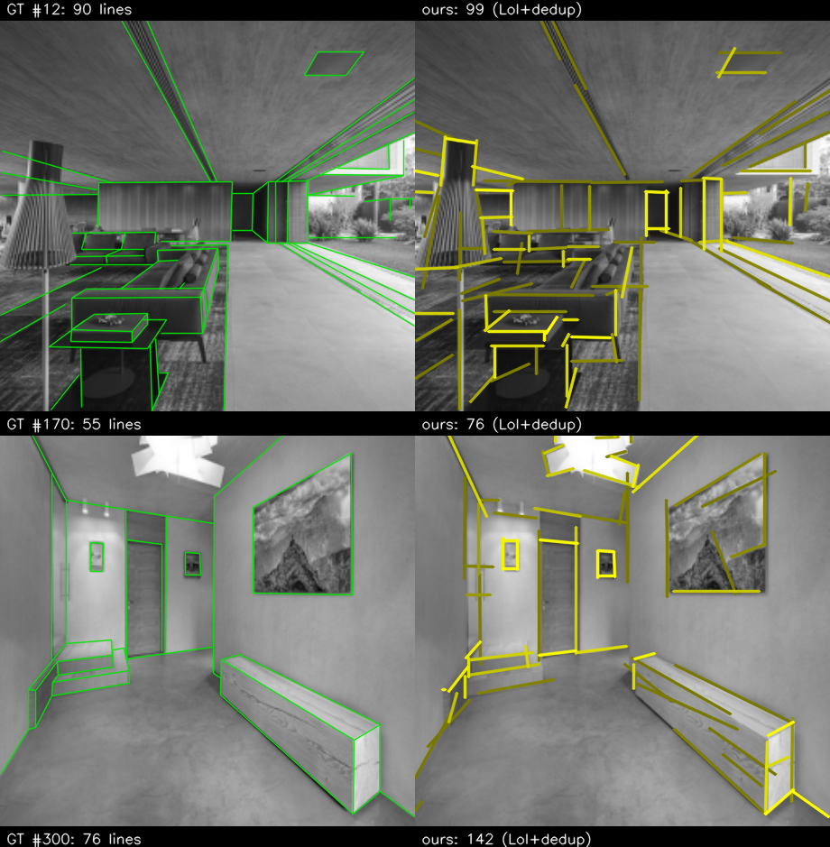

# MiLSD — Micro Line-Segment Detector

**A tiny, int8 line-segment detector that fits the 1 MB SRAM of an STM32H7 microcontroller** — ~0.39 M parameters, ~1 MB peak activation arena, reaching **structural AP (sAP¹⁰) = 24.1** on the ShanghaiTech Wireframe benchmark with no GPU and no neural accelerator.

<p align="left">
  
  
  
  
  
</p>

MiLSD keeps whole, scored line segments — not a dense edge map — and is evaluated with the field-standard structural Average Precision (sAP) used by L-CNN and HAWP. It builds on the single-stage, junction-free **F-Clip** representation (each grid cell predicts a line's *center*, *length*, and *angle*), shrinks the network to a microcontroller budget, and recovers most of the accuracy lost to that shrinkage with three **inference-time** stages: sub-pixel decoding, test-time augmentation, and a lightweight **Line-of-Interest (LoI) verification head**.

<p align="center"><br>
<em>Held-out Wireframe-val scenes — left: ground truth (green), right: MiLSD (yellow, LoI-verified).</em></p>

## Results

ShanghaiTech Wireframe, 462-image validation split. The deployed model is the `WIDTH=4` backbone (~0.39 M params) at 256 px input.

| Stage | sAP⁵ | **sAP¹⁰** | sAP¹⁵ |
|---|:---:|:---:|:---:|
| Tiny junction-free baseline (25 k params) | — | 10.6 | — |
| MiLSD backbone (`WIDTH=4`), trained | 12.1 | 17.8 | 21.2 |
| &nbsp;&nbsp;+ sub-pixel decode | 12.1 | 18.1 | 21.2 |
| &nbsp;&nbsp;+ test-time augmentation (TTA×4) | 15.1 | 21.0 | 24.0 |
| **&nbsp;&nbsp;+ LoI verification head (full MiLSD)** | **16.6** | **24.1** | **27.9** |
| *Oracle (perfect verifier, same candidates)* | *24.1* | *37.4* | *40.0* |

### Deployed int8 pipeline (v1.1)

Same split, int8 ONNX files from `export_int8.py` / `export_loi.py`, run with `eval_milsd.py`.
The LoI head here reads the 32-channel reduce map (see *Changes in v1.1*).

| Configuration | fp32 sAP¹⁰ | **int8 sAP¹⁰** | forward passes |
|---|:---:|:---:|:---:|
| Backbone, sub-pixel decode | 18.1 | **17.9** | 1 |
| + LoI verification | 22.1 | **21.9** | 1 |
| + TTA×4 | 21.0 | **20.8** | 4 |
| + TTA×4 + LoI | 23.9 | **23.7** | 4 |

The recommended on-device setting is **backbone + LoI without TTA** (1 pass, sAP¹⁰ 21.9). TTA adds ~1.8 points for 4× the latency.

The oracle row is the recall ceiling for the current candidate set: most remaining false positives are *real image edges absent from the sparse ground-truth annotation*, not hallucinations. For context, GPU/NPU-class parsers score 47–72 but need tens of megabytes of runtime memory and do not fit a microcontroller.

## How it works

```
image 256×256 ──► F-Clip backbone (int8 CNN) ──► 4 maps @128×128 ──► decode ──► TTA×4 ──► LoI verify ──► scored segments
                  5 conv blocks, WIDTH=4         center / length          (3×3 NMS         (frozen          (re-rank by
                  ~0.39M params, ~1MB arena      cos2θ / sin2θ            + sub-pixel)      backbone)        verify×center)
```

- **Output representation (F-Clip).** Each `128×128` cell predicts a line *center* confidence, a *length*, and an orientation as `(cos 2θ, sin 2θ)`. A segment is reconstructed analytically as `endpoint = center ± (length · [cos θ, sin θ])`. Single-stage and junction-free, so peak memory and compute are bounded and predictable — the property that makes it deployable on an MCU.
- **Backbone.** A small strided fully-convolutional network `[(32,/2),(64,/2),(128,/1),(128,/1),(128,/1)]` (channel width set by the `WIDTH` multiplier; the deployed model uses `WIDTH=4`), a `1×1` reduction, ×2 nearest-neighbour upsample, and a `3×3` output head. Quantizes to int8 (CMSIS-NN on device).
- **Decode.** `sigmoid(center)` → `3×3` max-pool NMS → 1-D parabolic sub-pixel refinement → reconstruct + score each segment.
- **TTA×4.** Average predictions over the image and its h/v/hv flips (negating `sin 2θ` on flip). 4× sequential forward passes, **no extra peak memory**.
- **LoI verification head.** The L-CNN/HAWP re-scoring mechanism, scaled to an MCU: for each candidate, sample 32 points along the line, bilinearly pool features from the backbone and the output maps, max-pool to a fixed length, concatenate a small geometric descriptor, and pass through a 3-layer MLP that classifies real vs. spurious. Detections are re-ranked by `verification × center`. Trained with the **backbone frozen**.

## Repository layout

```
MiLSD/
├── train_fclip_512.py      # train the F-Clip backbone (sAP eval built in)
├── milsd.py                # shared model / decode / LoI / sAP code (imported by the scripts below)
├── train_loi.py            # train the LoI verification head on the frozen backbone -> loi_256.pt
├── export_int8.py          # backbone -> int8 QDQ ONNX (split head, per-channel weights) -> milsd_int8.onnx
├── export_loi.py           # LoI MLP -> int8 QDQ ONNX -> loi_int8.onnx
├── eval_milsd.py           # sAP of the full pipeline, fp32 or int8, with/without TTA and LoI
├── recon_wireframe_512.py  # build / reconstruct the line-label npz
├── fix_wireframe_512.py    # line-encoding fix for the 512 npz
├── convert_local.py        # dataset conversion helper
├── eval_postproc.py        # sAP across the post-processing ladder (sub-pixel / TTA / LoI)
├── eval_dedup.py           # collinear-overlap de-duplication (operating-point precision)
├── eval_threshold.py       # confidence-threshold sweep
├── eval_heuristics.py      # weight-free post-processing baselines
├── eval_heuristics2.py     #   "
├── eval_pretrained_ref.py  # reference: pretrained M-LSD at matched resolution
├── viz_kitchen.py          # qualitative single-image visualization
├── viz_thresholds.py       # threshold-sweep visualization
├── fclip_256_best.pt       # pretrained backbone checkpoint (WIDTH=4, 256 px)  ← the deployed model
├── loi_256.pt              # trained LoI head (32-ch reduce features)
├── milsd_int8.onnx         # int8 backbone for ST Edge AI (outputs: center, length, angle, feat)
├── loi_int8.onnx           # int8 LoI head for ST Edge AI
├── assets/                 # result images used in this README
└── data/                   # put the Wireframe npz here (git-ignored)
```

## Installation

```bash
python3 -m venv .venv && source .venv/bin/activate
pip install -r requirements.txt
# Apple Silicon: training uses the MPS backend automatically; CUDA and CPU also work.
```

## Data

Training/eval expect a single NumPy archive `data/wireframe_lines_256_5000.npz` with arrays:

| key | shape | meaning |
|---|---|---|
| `Xtr`, `Xva` | `(N, H, W)` uint8 | grayscale images (train / val) |
| `Ltr`, `Lva` | object arrays | per-image line segments `[x1,y1,x2,y2]` in the `128²` label space |

Build it from the [ShanghaiTech Wireframe dataset](https://github.com/huangkuns/wireframe) with `recon_wireframe_512.py` (and `fix_wireframe_512.py` if you regenerate the 512 variant), then drop it in `data/`. All scripts also accept the npz path as the first argument.

## Training

Run everything from the repository root.

```bash
# 1) Backbone — F-Clip, WIDTH=4 (~0.39M params), 256 px, 300 epochs.
#    args: [npz] [input_size] [WIDTH] [epochs]   →   saves fclip_256_best.pt
python train_fclip_512.py data/wireframe_lines_256_5000.npz 256 4 300

# 2) LoI verification head on the FROZEN backbone.   args: [npz] [backbone_ckpt]  ->  saves loi_256.pt
python train_loi.py data/wireframe_lines_256_5000.npz fclip_256_best.pt

# 3) int8 export for the MCU, then evaluate fp32 and int8
python export_int8.py            # -> milsd_int8.onnx
python export_loi.py             # -> loi_int8.onnx
python eval_milsd.py --loi       # fp32
python eval_milsd.py --int8 --loi        # int8, as deployed  (add --tta for the 4-view ensemble)
```
 On an M1 the backbone trains in roughly 1–2 h; the head is much faster (backbone is frozen).

## Pretrained checkpoint

`fclip_256_best.pt` is the trained `WIDTH=4` backbone and `loi_256.pt` the trained LoI head. `milsd_int8.onnx` and `loi_int8.onnx` are the int8 files to import into ST Edge AI.

## Deployment (STM32H7)

The deployed pipeline is int8: PyTorch → ONNX → int8 QDQ (`export_int8.py`, `export_loi.py`) → ST Edge AI / X-CUBE-AI (CMSIS-NN kernels).

* **Backbone** `milsd_int8.onnx`: four outputs — `center` (logit), `length`, `angle` (cos2θ, sin2θ) at 128×128, and `feat` (32×64×64 reduce map). Each output has its own int8 scale; weights are per-channel.
* **Decode** (on the MCU, see `milsd.decode`): sigmoid, 3×3 peak NMS with the tie-safe rule (strict `>` against the 4 earlier neighbours, `>=` against the 4 later ones), parabolic sub-pixel fit, endpoints from length and angle.
* **LoI** `loi_int8.onnx`: for each candidate, 32 bilinear samples along the line from `feat` and the output maps, max-pooled to 4 bins, plus 4 geometry values → 148 inputs → MLP 256 → 128 → 1. Score = verification × center.
* **TTA** is optional (4 sequential passes, no extra peak memory).

## Changes in v1.1

* **int8 export bug fixed.** The first release quantized all four output maps into one int8 tensor with one scale. The center logits span about [-13, 8], so length and angle lost almost all precision: int8 sAP¹⁰ was 8.6 instead of 18.1. The head is now split into three output tensors with separate scales, and weights are per-channel.
* **Tie-safe peak NMS.** With int8 outputs, neighbouring cells often hold the same value; the old `C >= max(3×3)` test kept all of them and reported duplicates. Without this fix the int8 model loses about 2 points.
* **LoI reads the 32-ch reduce map** instead of the 128-ch conv4 map. Keeping the 512 KB conv4 map alive until after the head raised peak SRAM to about 1.15 MB, over the 1 MB budget. The reduce map (128 KB) is live anyway. Cost: about −0.2 sAP¹⁰. The center map enters the LoI as a probability, so one int8 input scale fits all LoI inputs.
* **The LoI head is saved** (`loi_256.pt`) and exported to int8 (`loi_int8.onnx`); shared code moved to `milsd.py`; hard-coded local paths removed.

## Citation

```bibtex
@misc{milsd2026code,
  author       = {Hassani Shariat Panahi, Parsa and Jalilvand, Amir Hossein and Najafi, M. Hassan},
  title        = {{MiLSD}: Micro Line-Segment Detector},
  year         = {2026},
  howpublished = {\url{https://github.com/<your-github-username>/MiLSD}}
}
```

## Acknowledgments

MiLSD builds on the **F-Clip** center/length/angle representation, the **L-CNN** / **HAWP** Line-of-Interest verification mechanism, the **M-LSD** lightweight-detector lineage, and the **ShanghaiTech Wireframe** benchmark. We thank their authors for releasing code and data.

## License

Released under the [MIT License](LICENSE).
